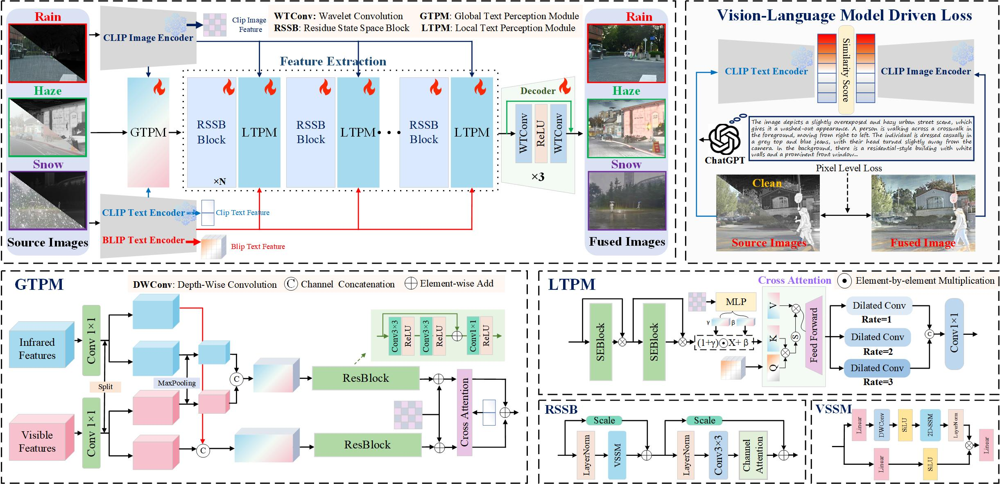
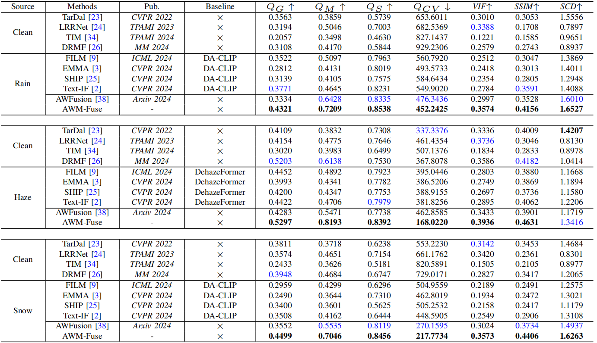
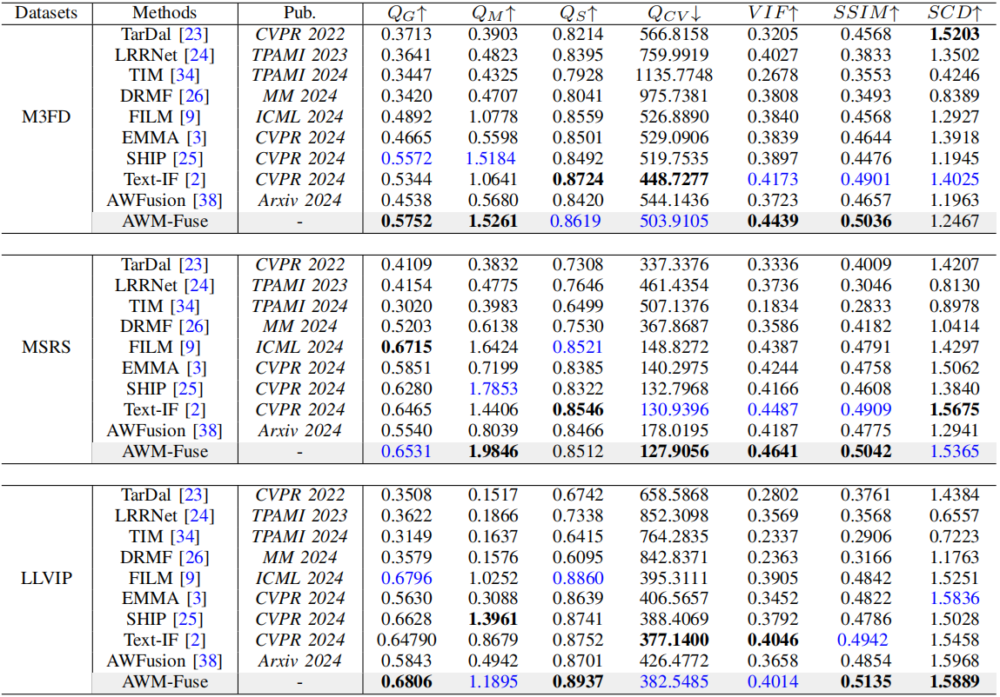
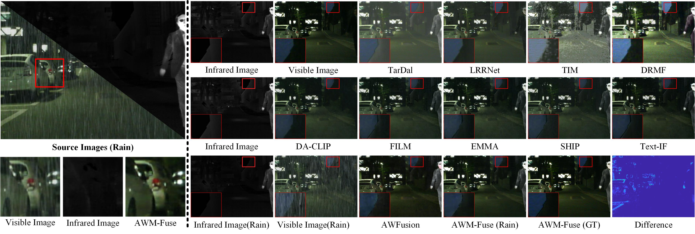
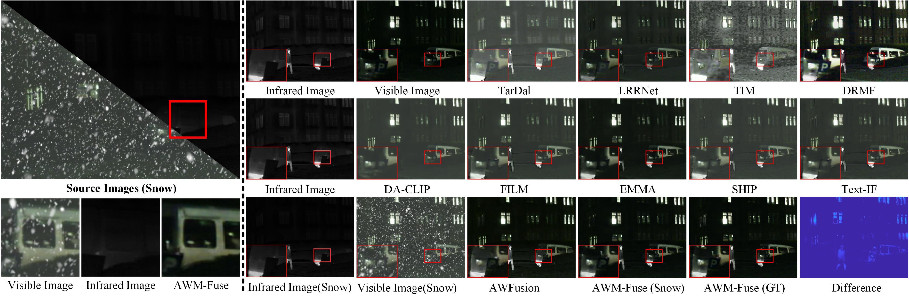

### Adverse Weather Multi-Modality Image Fusion via Global and Local Text Perception
 **Arxiv Link:** **https://arxiv.org/abs/2508.16881**
##  Network Architecture


## Contents
- [Datasets](#Datasets)
- [Training](#Training)
- [Testing](#Testing)
- [Gallery](#Gallery)
- [Table](#Table)
- Waiting....

<h2 id="Datasets"> Datasets</h2>
<table>
<thead>
  <tr>
    <th style="text-align: center;">Dataset and Model</th>
    <th>AWMM-100k</th>
    <th>Pre-trained Model</th>
  </tr>
</thead>
<tbody>
  <tr>
    <td>Baidu Cloud</td>
    <td> <a href="https://pan.baidu.com/s/1CPZcNob1BZaGNzwkKp3AGQ?pwd=cmn4">Download (cmn4)</a> </td>
    <td> <a href="https://pan.baidu.com/s/1sa2mGqsqG5Ju9MJNqqyuXg?pwd=37jh">Download (37jh)</a> </td>
  </tr>
</tbody>
</table>


<h2 id="Training"> Training</h2>

```
python train.py \
 --ir_path ./data/weather/ir \
 --vi_path ./data/weather/vi \
 --gt_path ./data/weather/gt_vi \
 --gt_ir_path ./data/weather/gt_ir \
 --clip_path ./data/weather/captions \
 --target_clip_path ./data/weather/gt_captions \
 --blip_vi_path ./data/weather/vi_npy \
 --blip_ir_path ./checkpoint/weather\
```

<h2 id="Testing"> Testing</h2>

Testing( An example of Haze.)
```
python test.py \
 --ir_path ./Test_imgs/Haze/ir \
 --vi_path ./Test_imgs/Haze/vi \
 --weights_path ./checkpoint/AWM-Fuse.pth \
 --save_path ./result/Haze  \
 --input_text ./Test_imgs/Haze/Haze_captions \
 --blip_vi_text ./Test_imgs/Haze/vi_npy \
 --blip_ir_text ./Test_imgs/Haze/ir_npy
```
<h2 id='Table'> Table</h2>
Table1. Comparison of quantitative results of different methods in ideal and adverse weather scenes. The best scores are in bold, while the second-best scores are in blue.



Table2. Quantitative comparison of all methods in three standard datasets. The best scores are in bold, while the second-best scores are in blue.


<h2 id='Gallery'> Gallery</h2>


Fig1. Comparison of image fusion results of different methods in ideal and rain scenes. The ”Difference” represents the difference map between AWM-Fuse (GT) and AWM-Fuse (Rain).


Fig2. Comparison of image fusion results of different methods in ideal and haze scenes.The ”Difference” represents the difference map between AWM-Fuse (GT) and AWM-Fuse (Haze).


Fig3. Comparison of image fusion results of different methods in ideal and snow scenes. The ”Difference” represents the difference map between AWM-Fuse (GT) and AWM-Fuse (Snow).


