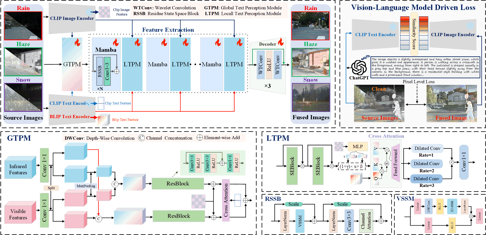
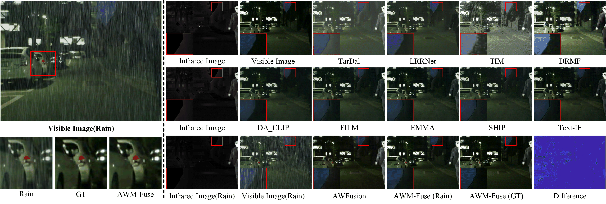
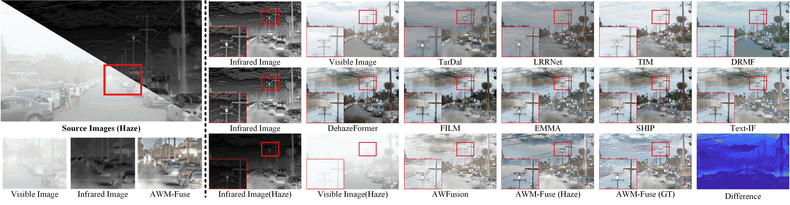

### Towards Unified and High-Fidelity Multi-Modality Image Fusion Model for Adverse Weather via Vision-Language Model
##  Network Architecture


## Contents
- [Testing](#Testing)
- [Gallery](#Gallery)


<h2 id="Testing"> Testing</h2>

Testing( An example of Haze.)
```
python test.py \
 --ir_path ./Test_imgs/Haze/ir \
 --vi_path ./Test_imgs/Haze/vi \
 --weights_path ./checkpoint/AWM_Fuse.pth \
 --save_path ./result/Haze  \
 --input_text ./Test_imgs/Haze/Haze_captions \
 --blip_vi_text ./Test_imgs/Haze/vi_npy \
 --blip_ir_text ./Test_imgs/Haze/ir_npy
```


<h2 id='Gallery'> Gallery</h2>


Fig1. Comparison of fusion results obtained by the proposed algorithm under rain weather and the results of the comparison methods under ideal condition.


Fig2. Comparison of fusion results obtained by the proposed algorithm under haze weather and the results of the comparison methods under ideal condition.


Fig3. Comparison of fusion results obtained by the proposed algorithm under snow weather, and the results of the comparison methods under ideal condition.


