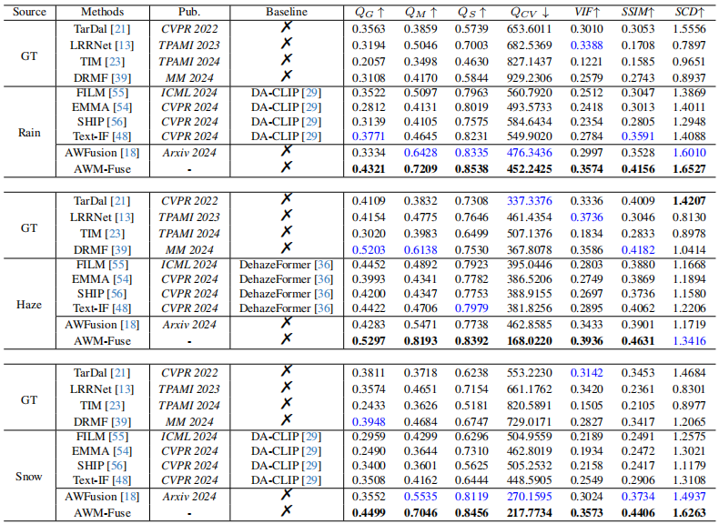

### Adverse Weather Multi-Modality Image Fusion via Global and Local Text Perception

##  Network Architecture


## Contents
- [Testing](#Testing)
- [Gallery](#Gallery)
- [Table](#Table)
- Waiting....

<h2 id="Testing"> Testing</h2>

Testing( An example of Haze.)
```
python test.py \
 --ir_path ./Test_imgs/Haze/ir \
 --vi_path ./Test_imgs/Haze/vi \
 --weights_path ./checkpoint/XXX_Fuse.pth \
 --save_path ./result/Haze  \
 --input_text ./Test_imgs/Haze/Haze_captions \
 --blip_vi_text ./Test_imgs/Haze/vi_npy \
 --blip_ir_text ./Test_imgs/Haze/ir_npy
```
<h2 id='Table'> Table</h2>
Table1. Comparison of quantitative results of different methods in ideal and adverse weather scenes. The best scores are in bold, while the second-best scores are in blue.




<h2 id='Gallery'> Gallery</h2>


Fig1. Comparison of image fusion results of different methods in ideal and rain scenes. The ”Difference” represents the difference map between XXX-Fuse (GT) and XXX-Fuse (Rain).


Fig2. Comparison of image fusion results of different methods in ideal and haze scenes.The ”Difference” represents the difference map between XXX-Fuse (GT) and XXX-Fuse (Haze).


Fig3. Comparison of image fusion results of different methods in ideal and snow scenes. The ”Difference” represents the difference map between XXX-Fuse (GT) and XXX-Fuse (Snow).


